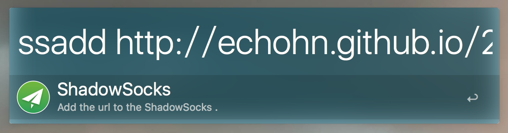

# shadowsocks-alfred-workflow

这个 Workflow 主要用于方便添加网站域名到 ShadowSocks 的 pac 文件。

其原理是将域名添加到 `~/.ShadowsocksX/user-rule.txt` 文件，然后执行 [update_gfwlist.sh](https://raw.githubusercontent.com/echohn/shadowsocks-alfred-workflow/master/update_gfwlist.sh) 脚本。

你也可以查看我的[这篇文章](http://echohn.github.io/2016/05/29/to-build-the-fullstack-tools-for-over-the-wall/)，其中有相关说明。
